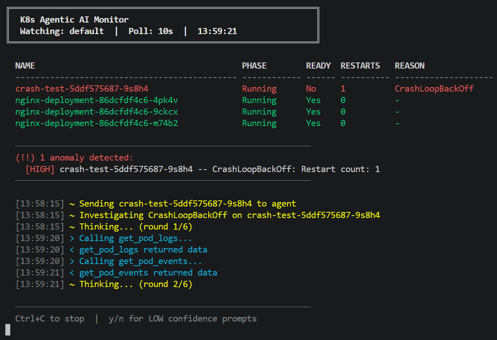

# K8s Agentic AI Monitor

A terminal-based agentic AI system that watches a Kubernetes cluster, detects problems,
reasons about them using a local LLM, and either fixes them automatically or asks the
operator before acting. Everything runs locally -- no external API calls, no cloud, no paid services.

> **Built to demonstrate AI + DevOps working together** -- an agentic loop with a real safety
> boundary, cooldown logic, and structured decision-making running against a live Kubernetes cluster.

---

## Demo


https://github.com/user-attachments/assets/6f3d2d0c-e2fd-4297-bc5a-c4406e7f9040





---

## How It Works

```
watcher detects CrashLoopBackOff
        |
        v
agent.py sends problem to local LLM (qwen2.5:7b via Ollama)
        |
        |-- LLM calls get_pod_logs   --> tools.py executes it
        |-- LLM calls get_pod_events --> tools.py executes it
        |
        +-- LLM outputs final JSON decision:
            {"confidence":"HIGH","action":"restart_pod","target":"crash-test",...}
                    |
            HIGH --> execute restart_pod() automatically
            LOW  --> ask operator [y/n]
```

**Key safety boundary -- the LLM never touches the cluster directly.**
It only sees read tools during investigation. It outputs a JSON recommendation.
`main.py` executes the action after validating it against the cooldown tracker.

---

## Architecture

```
k8s-agent/
|
+-- main.py              <- entry point, polling loop, decision handler
+-- config.yaml          <- all tunable settings
|
+-- agent/
|   +-- watcher.py       <- polls K8s API, detects anomalies
|   +-- tools.py         <- 9 K8s tool functions (6 read, 3 action)
|   +-- agent.py         <- agentic loop, Ollama integration
|   +-- cooldown.py      <- prevents thrashing, escalation logic
|   +-- display.py       <- color-coded terminal UI
|   +-- logger.py        <- daily rotating file logging
|   +-- config.py        <- config.yaml loader
|   +-- utils.py         <- shared helpers
|
+-- logs/
    +-- agent_YYYY-MM-DD.log
```

### Components

**watcher.py** -- Connects to the cluster via kubeconfig. Polls every N seconds.
Detects CrashLoopBackOff, OOMKilled, PendingTooLong, and HighRestartCount anomalies.

**agent.py** -- The agentic loop. Sends anomalies to the LLM with tool definitions.
Executes tool calls, feeds results back, loops until the model outputs a JSON decision.
Guards against duplicate tool calls and stalled reasoning with push messages.

**tools.py** -- 6 read tools the LLM can call during investigation. 3 action tools
(restart, scale, rollback) that only `main.py` can execute -- never the LLM.

**cooldown.py** -- Tracks every action by `(deployment_name, action_type)`.
Blocks repeats within a configurable window. Escalates to alert-only after N failed attempts.
Uses stable deployment names so cooldown survives pod restarts with new random suffixes.

**display.py** -- Fixed-layout terminal screen. Redraws the pod table and anomaly
section every poll. Agent log tail shows the last 10 events live during investigation.
Full confirmation screen for LOW confidence decisions.

**logger.py** -- Writes every event to `logs/agent_YYYY-MM-DD.log`. New file per day.
Appends across multiple runs on the same day. Delete old files freely.

---

## Tech Stack

| Layer | Tool | Version |
|---|---|---|
| Language | Python | 3.11+ |
| K8s client | kubernetes (official) | 36.0.1 |
| LLM | qwen2.5:7b via Ollama | -- |
| Ollama client | openai (OpenAI-compatible) | 2.38.0 |
| Terminal colors | colorama | 0.4.6 |
| Config | pyyaml | 6.0.3 |

> **Why the `openai` library for a local LLM?**
> Ollama exposes an OpenAI-compatible REST API at `/v1`. The `openai` library has
> a proven, clean interface for multi-round tool calling that the agent loop is built
> around. It points at `localhost:11434` -- no data leaves the machine.

---

## Requirements

| Requirement | Detail |
|---|---|
| OS | Linux, macOS, or Windows (WSL recommended) |
| Python | 3.11+ |
| RAM | 6GB minimum (8GB recommended) |
| Kubernetes | Any cluster accessible via kubeconfig (Minikube, EKS, on-prem) |
| Ollama | Installed and running locally |
| Model | `qwen2.5:7b` pulled via Ollama (needs ~4GB RAM free) |

---

## Setup

### 1. Clone the repository

```bash
git clone https://github.com/Tejaspise93/k8s-agent.git
cd k8s-agent
```

### 2. Create and activate a virtual environment

```bash
python -m venv venv

# Linux / macOS
source venv/bin/activate

# Windows
venv\Scripts\activate
```

### 3. Install dependencies

```bash
pip install -r requirements.txt
```

### 4. Install and start Ollama

```bash
# Linux
curl -fsSL https://ollama.com/install.sh | sh

# macOS
brew install ollama
```

Pull the model:
```bash
ollama pull qwen2.5:7b
```

> **Low RAM machine?** Pull `qwen2.5:3b` instead (~2.5GB) and update `model` in `config.yaml`.

### 5. Ensure your cluster is accessible

```bash
kubectl get pods   # should return without error
```

Minikube:
```bash
minikube start
```

### 6. Review config.yaml

```yaml
namespace: "default"         # namespace to watch
poll_interval: 10            # seconds between polls
model: "qwen2.5:7b"          # Ollama model
cooldown_window_seconds: 300 # 5 minutes between repeat actions
cooldown_max_attempts: 3     # escalate after 3 failed fixes
```

### 7. Run

```bash
python main.py
```

---

## Tests -- See It In Action

These tests demonstrate each capability of the system against a real cluster.

### Test 1 -- CrashLoopBackOff detection and auto-fix

Create a pod managed by a Deployment that crashes immediately:
```bash
kubectl create deployment crash-test --image=busybox -- /bin/sh -c "exit 1"
```

**What to watch for:**
- Watcher detects `CrashLoopBackOff` within one poll cycle
- Agent calls `get_pod_logs` and `get_pod_events`
- Decision: `restart_pod` with HIGH confidence
- Pod deleted, Deployment recreates it automatically

Clean up:
```bash
kubectl delete deployment crash-test
```

---

### Test 2 -- Cooldown blocking repeated restarts

Use the same crash-test Deployment from Test 1 and let it run for two full cooldown cycles.

**What to watch for:**
- First detection → agent investigates → restart executed
- New pod created with different suffix (e.g. `crash-test-abc-xyz`)
- Second detection → `[~] crash-test already investigated -- cooldown:Xs remaining`
- Cooldown correctly uses deployment name, not pod name, so it holds across restarts

---

### Test 3 -- Escalation after max attempts

Set `cooldown_window_seconds: 5` and `cooldown_max_attempts: 2` in `config.yaml`
temporarily to trigger escalation quickly.

**What to watch for:**
- First restart → executed
- Second restart → executed (after 5s cooldown)
- Third detection → `[!] ESCALATED: crash-test has failed 2 times -- human review needed`
- Agent stops auto-fixing, alert only

Restore original values in `config.yaml` after testing.

---

### Test 4 -- LOW confidence human confirmation

Create a pod that has high restarts but no clear crash reason:
```bash
kubectl create deployment flaky-test --image=busybox -- /bin/sh -c "sleep 2 && exit 0"
```

**What to watch for:**
- `HighRestartCount` anomaly detected
- Agent investigates but finds no clear crash evidence
- Decision: LOW confidence
- Full confirmation screen appears: `(!!) LOW CONFIDENCE -- HUMAN REVIEW REQUIRED`
- Type `y` to execute or `n` to skip

Clean up:
```bash
kubectl delete deployment flaky-test
```

---

### Test 5 -- OOMKilled detection

Create a pod that exceeds its memory limit:
```yaml
# oom-test.yaml
apiVersion: apps/v1
kind: Deployment
metadata:
  name: oom-test
spec:
  replicas: 1
  selector:
    matchLabels:
      app: oom-test
  template:
    metadata:
      labels:
        app: oom-test
    spec:
      containers:
      - name: oom-test
        image: python:3.11-slim
        resources:
          limits:
            memory: "50Mi"
        command: ["python", "-c", "data = ' ' * 100 * 1024 * 1024"]
```

```bash
kubectl apply -f oom-test.yaml
```

**What to watch for:**
- `OOMKilled` appears in the REASON column
- Agent detects it as HIGH severity
- Decision: `restart_pod` (OOMKilled is a clear signal)

Clean up:
```bash
kubectl delete -f oom-test.yaml
```

---

### Test 6 -- Healthy cluster, no false positives

Scale up a working nginx deployment:
```bash
kubectl create deployment nginx --image=nginx --replicas=3
```

**What to watch for:**
- All 3 pods show green in the terminal
- `:) No anomalies detected.`
- Agent is never invoked
- No log entries written beyond startup

Clean up:
```bash
kubectl delete deployment nginx
```

---

## Where This Can Be Used

### Bastion host watching an EKS cluster

Deploy the monitor on a bastion host that already has `kubectl` access to your EKS cluster.
The kubeconfig on the bastion points at EKS -- no code changes needed.
Ollama runs locally on the bastion. The agent watches production namespaces and
pages the on-call engineer for LOW confidence decisions.

```
Bastion host (EC2)
  +-- Ollama (local LLM)
  +-- k8s-agent (this project)
  +-- kubeconfig -> EKS cluster
```

### On-premises Kubernetes cluster

Run the monitor on any node or management machine inside the network.
Works with kubeadm, k3s, Rancher, or any standard Kubernetes distribution.
Useful for teams running private infrastructure without access to managed cloud services.

### Local development cluster (Minikube / kind)

Run it on your own machine during development to catch crashes and restarts
automatically while you work. Faster feedback loop than watching `kubectl get pods`
in a separate terminal.

### CI/CD pipeline health monitoring

Point the monitor at a dedicated `staging` namespace where your CI/CD deploys to.
Let it watch for deployment failures, OOMKills, and crash loops during integration tests.
The log file gives a timestamped record of every problem and action taken.

---

## Future Work

### Email escalation for LOW confidence decisions
When the agent reaches a LOW confidence decision, instead of only prompting the
operator at the terminal, send an email to a configured developer address containing:
- What anomaly was detected and when
- The agent's reasoning and recommendation
- Last 50 lines of the pod's logs
- The proposed action awaiting approval

The monitor continues polling and detecting while waiting. It does not retry the fix --
it flags the resource as pending human review and shows it in the terminal.

### Web dashboard with multi-namespace filtering
Replace the terminal UI with a browser-based dashboard. Each namespace gets its own
view. Operators can filter by namespace, severity, or anomaly type. The agent log tail
becomes a live feed in the browser. Actions can be approved or declined from the UI
instead of the terminal prompt.

### Upgraded LLM
`qwen2.5:7b` works well but is constrained by the current 8GB RAM environment.
On a machine with 16GB+ RAM, replace it with `qwen2.5:14b` or `qwen2.5:32b` for
more reliable structured output, better tool-calling consistency, and deeper reasoning
about complex multi-pod failure scenarios. A larger model would also produce LOW
confidence decisions more naturally on genuinely ambiguous cases -- the current model
treats BackOff events as sufficient signal to always decide HIGH confidence, making
the human confirmation path difficult to trigger in practice.

### Expanded anomaly detection
The current watcher detects 4 anomaly types. Planned additions:
- **ImagePullBackOff** -- bad image name or missing registry credentials
- **Evicted** -- pod evicted due to node memory or disk pressure
- **Unschedulable** -- insufficient cluster resources to place the pod
- **ContainerCreating too long** -- stuck init containers or volume mount failures
- **Deployment stalled rollout** -- new version not rolling out, old version stuck

### LOW confidence confirmation testing
The human confirmation screen is implemented and the code path is correct.
Due to the limitation above (qwen2.5:7b always deciding HIGH on BackOff events),
triggering it reliably requires either a larger model or a genuinely ambiguous
real-world scenario such as a pod with high restarts caused by a flapping network
dependency or a misconfigured init container with no clear error output.
To verify the screen works during development, temporarily add this line in
`agent.py` after the decision is parsed:
```python
if decision and decision.get("action") != "none":
    decision["confidence"] = "LOW"  # force LOW to test confirmation screen -- remove after testing
```

---

## Design Decisions

**LLM never touches the cluster.**
The model only sees read tools during investigation. It outputs a JSON recommendation.
`main.py` validates it, checks the cooldown tracker, and executes the action.
This is a hard safety boundary -- reasoning and acting are separated by design.

**Why Qwen2.5 specifically?**
Qwen2.5 is the only model family in the 4gb size range that was trained with structured output and tool calling as primary objectives. Alibaba's training data for Qwen2.5 includes heavy emphasis on function calling benchmarks. At the 7b parameter count it consistently outperforms Mistral, Phi3, and Llama on tool use tasks.

**Cooldown tracks deployment names, not pod names.**
When a pod is restarted it gets a new random suffix. Tracking by pod name would
lose the cooldown on every restart. Stripping the ReplicaSet and pod hash gives a
stable key that persists across the entire lifetime of a Deployment.

**OpenAI library for local LLM.**
Ollama exposes an OpenAI-compatible REST API. Using the `openai` library gives a
proven, well-documented interface for multi-round tool calling without any data
leaving the machine.

**Daily rotating log files.**
One file per day in `logs/`. Appends across multiple runs on the same day.
Delete old files without affecting anything. No log rotation library needed.
